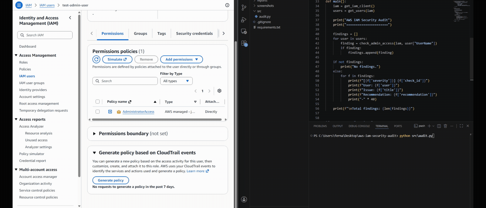
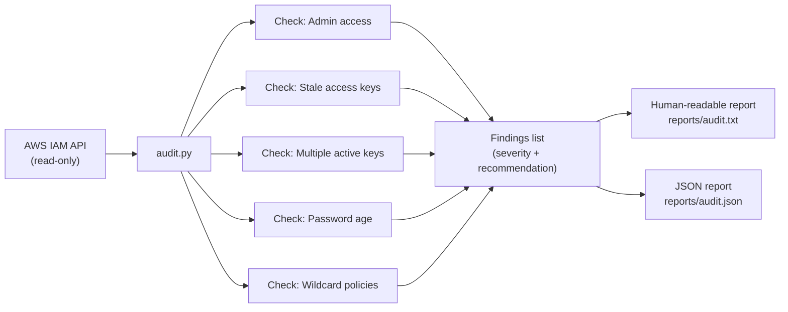
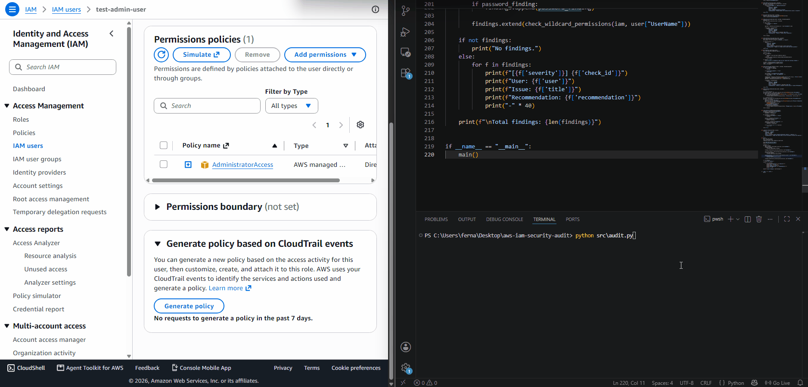
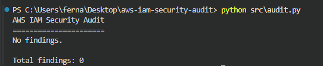
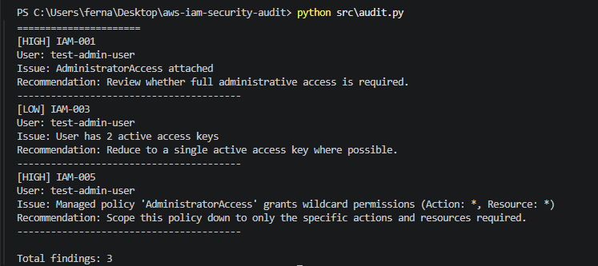

# AWS IAM Security Audit

A read-only command-line tool that scans an AWS account's IAM users for five
common misconfigurations — stale credentials, excessive access, and
overly-broad permissions — and produces a findings report a human can act on.



## Why I built this

IAM hygiene is one of the most common real-world sources of cloud security
incidents — not exotic zero-days, but boring things like an access key that's
been active for two years, or a user that was given `AdministratorAccess`
"just to get something done" and never had it revoked. I wanted a first
project that mapped to that actual, everyday problem rather than a toy
exercise, and that forced me to think about a tool the way a security team
would: what does it check, how confident is each check, what's the blast
radius if the tool itself is compromised, and what does a human do with the
output.

I also deliberately scoped this down. The original plan sketched a much
bigger roadmap (S3 buckets, security groups, Terraform, CI integration). I
cut that to one well-tested tool doing five checks correctly, because a
finished, documented V1 is worth more — to a reviewer and to my own
understanding — than five half-built features.

## How it works



In plain terms: the tool asks AWS "who are your users and what can they do,"
runs five independent checks against the answer, and writes out what it
found — it never changes anything in the account itself.

## What it checks

| ID | Check | Severity | Why it matters |
|----|-------|----------|-----------------|
| IAM-001 | `AdministratorAccess` policy attached | HIGH | Full account control on a single credential is the highest-impact misconfiguration a user account can have. |
| IAM-002 | Active access key older than 90 days | MEDIUM | Long-lived keys are a bigger target — more time for a leak to go unnoticed. |
| IAM-003 | More than one active access key | LOW | Extra active keys are extra ways in, usually left over from a rotation that was never finished. |
| IAM-004 | Console password older than 90 days | MEDIUM | Stale passwords without enforced rotation are a common gap in account hygiene. |
| IAM-005 | Policy grants `Action: *` + `Resource: *` | HIGH | A wildcard-on-wildcard statement grants unrestricted access, whether or not the user realizes it's that broad. |

**A note on IAM-005:** this check is a heuristic, not a complete IAM policy
evaluator. Real policy evaluation involves `Condition` blocks, explicit
denies, `NotAction`/`NotResource`, and permission boundaries — a genuinely
complex system to reproduce. This check flags the unambiguous case (a
literal `Action: *` combined with `Resource: *` on an `Allow` statement) and
makes no claim beyond that.

**A note on IAM-004:** the date-parsing logic was built and validated
against real credential-report data pulled from my sandbox account — the
report generation, CSV parsing, and date comparison all run correctly with
no errors. What I couldn't do is force this specific check to actually
*fire* the way I did for IAM-002 (see below), because a password's age can't
be artificially inflated the way I inflated a key's age for testing —
resetting a password just restarts its clock at zero. I'm treating this as a
known testing limitation on a time-based check, not a gap in the logic
itself.

## Challenges and how I solved them

**Access-key age can't be tested without waiting or faking the threshold.**
`CreateDate` is set the moment AWS creates a key, so a freshly created test
key is always "0 days old" — nowhere near the 90-day threshold. To confirm
the comparison logic actually worked, I temporarily called the check with a
negative threshold (`threshold_days=-1`) so a same-day key would still
count as "older" than the threshold, confirmed the finding fired correctly,
then reverted to the real 90-day default. That's also why the strict `>`
comparison matters: with `threshold_days=0` and a same-day key, `0 > 0` is
`False`, so nothing fires — I had to use a negative test threshold rather
than zero to actually exercise the branch.

**A function I wrote wasn't actually being called.** After adding
`check_multiple_active_keys`, the audit kept reporting only one finding even
after I'd confirmed via the AWS CLI that the sandbox user had two active
keys. The function itself was correct — it just was never invoked inside
`main()`'s loop, so it silently did nothing. The same thing happened again
later with `check_wildcard_permissions`. Both times, the fix was the same:
add the missing call inside the per-user loop. It was a good reminder that
"the code looks right" and "the code runs" are two different checks, and
that I should verify a new check actually appears in a real run before
trusting it's wired in.

**AWS's credential report is asynchronous.** Password age isn't available
from a simple, single API call — you have to request a credential report
with `generate_credential_report()`, then separately call
`get_credential_report()` to fetch it. My first attempt assumed the report
would just be ready by the second call, but AWS builds it in the background
and raises a `CredentialReportNotReadyException` if you ask before it's
done. I initially wrote a retry loop that checked `if response:` after the
call, which never worked, because the failure comes back as an *exception*,
not a falsy return value. The fix was to wrap the call in a `try/except`
for that specific exception and retry with a short delay, with a hard cap
on attempts so the tool fails cleanly instead of looping forever if
something else goes wrong.

**IAM policies don't have one consistent shape.** A policy's `Statement`
field can be a single object or a list, and `Action`/`Resource` can each be
a single string or a list, depending on how the policy was written. My
wildcard check needed to handle both shapes consistently, so I normalized
everything to a list before evaluating it, rather than writing separate
branches for each shape.

**The auditor's own permissions had to grow as the tool did.** I scoped
`SecurityAuditorReadOnly` to only what Checks #1–#4 needed. As soon as I
wired in the wildcard-policy check, it failed with `AccessDenied` on
`iam:GetPolicy` — an action I hadn't anticipated needing until I actually
wrote the code that called it. Rather than pre-granting a broad set of
permissions "just in case," I added exactly the four new actions
(`ListUserPolicies`, `GetUserPolicy`, `GetPolicy`, `GetPolicyVersion`) the
new check required and nothing more. That `AccessDenied` error is actually
good evidence the least-privilege design was working as intended — the tool
genuinely couldn't do anything beyond what its policy explicitly listed.

**How far to take the wildcard check.** A full IAM policy evaluator that
accounts for `Condition` blocks, `NotAction`, and permission boundaries is a
significant project on its own. I made a deliberate call to ship a simpler
heuristic — flag literal `Action: *` + `Resource: *` statements — and say so
explicitly in this README, rather than overclaim a capability the tool
doesn't have. I'd rather a reviewer trust the four things it does check than
distrust a tool that claims to catch everything.

**Scoping the tool's own permissions.** It would have been easy to run this
with an admin credential and move on. Instead I wrote a dedicated read-only
policy (`auditor-policy.json`) for the auditor itself, so a security tool
that inspects IAM doesn't become an IAM risk on its own.

**Testing safely.** To see the checks actually fire, I needed an account
with real misconfigurations — but I didn't want to touch anything
production-adjacent. I built a disposable sandbox IAM user
(`test-admin-user`) with intentionally bad settings, confirmed the relevant
checks fired, then removed the bad settings and confirmed the findings
cleared. That before/after is captured in the demo below.

## Demo

**Detect** — a sandbox user is given admin access and a second access key; findings appear:


**Remediate** — `AdministratorAccess` is removed and the extra key deactivated; findings clear:



Full output examples:




## Design decisions worth knowing

- **Read-only, by design.** The tool detects and recommends; a human decides
  on and applies the fix. This mirrors how most real security tooling
  works — very few automated scanners get write access to production IAM,
  and for good reason. Detect → recommend → human remediation → validate is
  a more honest framing than "this script fixes your account."
- **Credential report over per-user calls.** Password age is read from one
  `GenerateCredentialReport` / `GetCredentialReport` call rather than N
  per-user API calls, which scales better as the account grows — at the
  cost of a short polling wait while the report generates.
- **Least privilege for the auditor itself.** See `auditor-policy.json` —
  the tool can only ever read IAM data, never modify it. The policy grew
  incrementally, one action at a time, as each check actually needed it
  (see Challenges above) rather than being over-provisioned up front.

## Setup

1. Install dependencies:
   ```
   pip install -r requirements.txt
   ```
2. Create a dedicated IAM user or role for the auditor and attach the
   permissions in `auditor-policy.json` (read-only IAM access only).
3. Configure a named AWS CLI profile for it:
   ```
   aws configure --profile security-auditor
   ```
4. Verify your setup:
   ```
   aws sts get-caller-identity --profile security-auditor
   ```

## Usage

Human-readable report (printed to terminal, saved to `reports/audit.txt`):
```
python src/audit.py
```

JSON report (printed to terminal, saved to `reports/audit.json`):
```
python src/audit.py --json
```

## Skills demonstrated

- AWS IAM concepts: users, policies, access keys, credential reports
- `boto3` SDK usage, including asynchronous report generation and handling
  service-specific exceptions
- Secure-by-design tooling: least-privilege scoping for the tool itself,
  expanded deliberately and only as new checks required it
- CLI design with both human-readable and machine-readable (JSON) output
- Safe, repeatable testing methodology using a disposable sandbox account,
  including working around checks that can't be triggered on demand
- Debugging real issues: an unwired function silently doing nothing, a
  misunderstood async API, and a permissions gap surfaced by `AccessDenied`
- Technical writing: documenting trade-offs and known limitations honestly

## Possible future work

Not a roadmap I'm committed to — a finished, well-documented IAM checker is
a complete project on its own — but natural next steps if I extend this:

- Pagination handling for `list_users` in accounts with more than 100 users
- S3 bucket public-access auditing
- Security group over-exposure checks
- Terraform-based sandbox provisioning
- CI integration (GitHub Actions) to run the audit on a schedule
- Alerting on new HIGH-severity findings