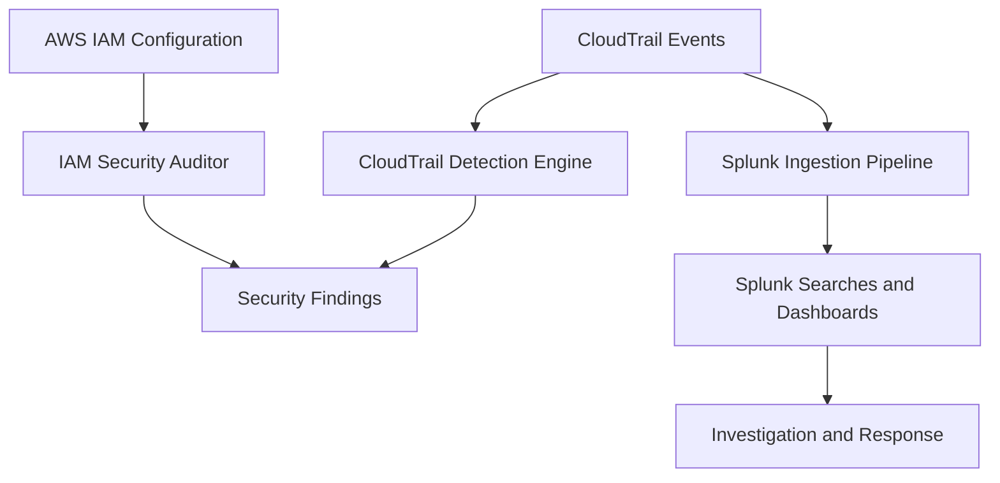

# Cloud Security Detection Suite

A modular cloud security toolkit combining AWS IAM configuration auditing, CloudTrail threat detection, and Splunk-based security monitoring and investigation.

This repository consolidates three security projects into a single portfolio, demonstrating complementary approaches to identifying risky configurations, detecting suspicious cloud activity, and investigating security events.

## Project Overview

The suite contains three modules:

| Module | Purpose |
|---|---|
| [IAM Security Auditor](modules/iam-auditor/README.md) | Audits AWS IAM configurations and identifies potentially risky permissions and policies. |
| [CloudTrail Detection Engine](modules/cloudtrail-detection/README.md) | Analyzes CloudTrail events and implements detection logic for suspicious IAM and account activity. |
| [Splunk CloudTrail Lab](modules/splunk-lab/README.md) | Documents CloudTrail ingestion, Splunk searches, detection investigations, and security monitoring workflows. |

## Architecture



The modules address different stages of cloud security monitoring. They are organized together in one repository, but they remain distinct tools with their own implementation and setup requirements.

## Key Capabilities

### IAM Security Auditing
- Identify potentially risky IAM policies and permissions.
- Evaluate configurations against security-focused checks.
- Generate audit findings and reports.
- Support repeatable auditing workflows.

### CloudTrail Detection
- Analyze AWS CloudTrail activity.
- Detect suspicious IAM changes and other security-relevant events.
- Correlate related events where supported by the detection logic.
- Run automated tests against detection behavior.

### Splunk Security Monitoring
- Ingest and search CloudTrail events.
- Investigate suspicious cloud activity using SPL.
- Document detection workflows, threat hunts, and dashboards.
- Troubleshoot ingestion and parsing issues.

See each module's README for its implemented features, limitations, screenshots, and instructions.

## Repository Structure

```text
cloud-security-detection-suite/
├── README.md
└── modules/
    ├── iam-auditor/
    │   ├── src/
    │   ├── tests/
    │   ├── assets/
    │   └── README.md
    ├── cloudtrail-detection/
    │   ├── src/
    │   ├── tests/
    │   ├── docs/
    │   ├── .github/
    │   └── README.md
    └── splunk-lab/
        ├── screenshots/
        └── README.md
```

## Getting Started

Clone the repository:

```bash
git clone https://github.com/FCortezSecurity/cloud-security-detection-suite.git
cd cloud-security-detection-suite
```

Choose the module you want to explore and follow its dedicated README.

- [IAM Auditor setup and usage](modules/iam-auditor/README.md)
- [CloudTrail Detection setup and usage](modules/cloudtrail-detection/README.md)
- [Splunk Lab setup and investigation workflow](modules/splunk-lab/README.md)

Requirements, dependencies, AWS permissions, and setup procedures vary by module. Review the relevant documentation before running any scripts.

## Testing and Validation

The CloudTrail detection module includes automated tests and a GitHub Actions workflow. Refer to its documentation for the test commands and supported scenarios.

The IAM auditing and Splunk lab modules have their own validation and operational requirements. Consult their respective READMEs before treating findings or screenshots as evidence of a successful run in a different environment.

## Security Considerations

- Never commit AWS access keys, secret keys, session tokens, or other credentials.
- Follow the principle of least privilege when configuring AWS access.
- Review scripts before running them against a real account.
- Prefer isolated test environments and sanitized sample data.
- Treat automated findings as investigation leads, not definitive proof of compromise.
- Review each module's documented limitations before relying on its results.

## Scope and Limitations

This repository is a portfolio and learning project, not a certified security product or a substitute for a comprehensive cloud security program.

Detection coverage depends on available telemetry, configuration, event types, and the logic implemented in each module. IAM policy checks may use heuristics and should not be interpreted as a complete authorization analysis unless explicitly documented.

The modules are consolidated under one repository; this does not mean they share a single runtime or that every workflow is fully integrated.

## Author

**FCortezSecurity**

GitHub: [@FCortezSecurity](https://github.com/FCortezSecurity)

---

*Explore the individual modules for implementation details, demonstrations, detection logic, and technical documentation.*
