# AWS CloudTrail + Splunk Detection & Threat Hunting Lab

A hands-on Security Operations Center (SOC) lab that ingests real AWS activity into Splunk, detects suspicious behavior, hunts for threats proactively, and investigates findings like an analyst would — end to end, with real evidence at every step.

---

## What This Project Actually Does (Plain-English Version)

Imagine every single action anyone takes in an AWS account — logging in, creating a user, changing a permission, deleting something — gets written down automatically, like a security camera log for a cloud account. AWS calls this log **CloudTrail**.

On its own, that log is just a giant pile of text files. This project builds a pipeline that:

1. **Collects** that log automatically (AWS → cloud storage → a message queue → Splunk)
2. **Watches** it for specific patterns that matter — like "did someone just create a new set of login credentials?" or "did the master account get used when it shouldn't be?"
3. **Alerts** when those patterns show up
4. **Investigates** what happened, the way a security analyst would: who did it, from where, and does it look legitimate or not
5. **Documents** all of it — the good practice, the finding, and what to do about it

In short: this is a small, self-contained version of what a company's security team does every day to keep an eye on their cloud environment.

---

## Goals of This Project

- Demonstrate the **full SOC workflow**, not just "I wrote a detection": Generate → Collect → Detect → Hunt → Investigate → Document → Remediate → Validate
- Build real, working detections against **real, self-generated data** — not synthetic/sample logs
- Practice **SPL (Splunk's query language)** from first principles up through correlation logic
- Show understanding of **why** a detection matters (MITRE ATT&CK mapping), not just that it works
- Practice **investigation and documentation discipline** — the skills that actually separate a junior SOC analyst from someone who can just write a query
- Keep the scope intentionally lean — no automated remediation, no massive custom app, no unnecessary complexity. The value is in demonstrating a real investigative workflow.

---

## Architecture

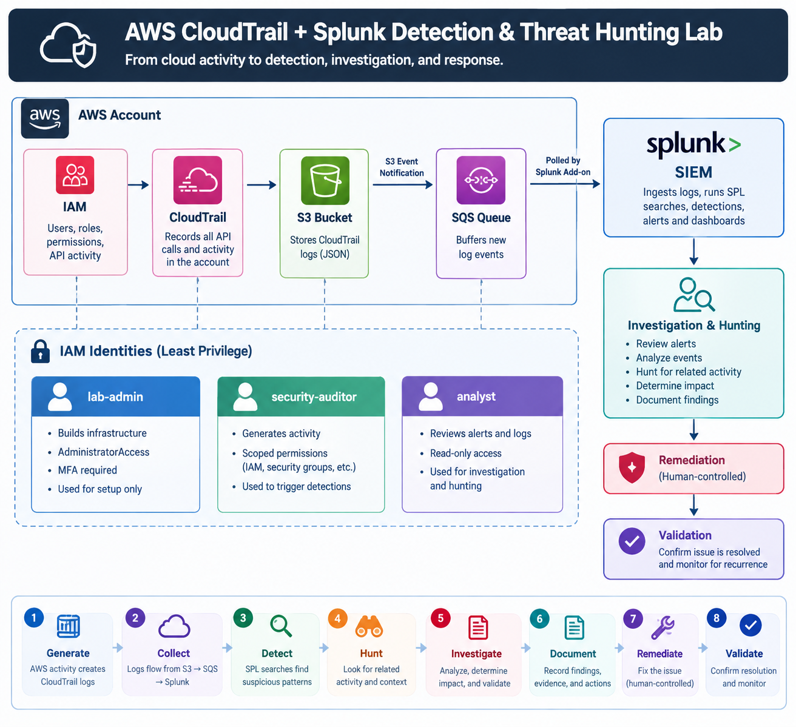

The pipeline flows left to right: **IAM activity → CloudTrail → S3 → SQS (via S3 event notification) → Splunk**, where SPL searches turn raw events into detections, alerts, and dashboards. From there, every finding moves through the same 8-step loop this project is built around: **Generate → Collect → Detect → Hunt → Investigate → Document → Remediate → Validate**, with remediation kept strictly human-controlled.

**Identity design:** three separate IAM identities, each with a distinct, scoped role — mirroring least-privilege practice in a real environment:
- **`lab-admin`** — builds infrastructure, has `AdministratorAccess`, MFA-protected, used for all setup work
- **`security-auditor`** — the "activity generator." Intentionally scoped to only the permissions needed to trigger the behaviors this lab detects (IAM actions, security-group changes) — not full admin
- **`analyst`** (implemented as `cloudtrail-detector`, a read-only identity carried over from an earlier project) — read-only access, used for reviewing alerts and logs during investigation and hunting, never for generating activity or making changes

---

## Technologies Used

| Component | Purpose |
|---|---|
| AWS IAM | Identity and permission management |
| AWS CloudTrail | Security/audit telemetry source |
| Amazon S3 | Log storage |
| Amazon SQS | Event notification queue (S3 → Splunk pipe) |
| Splunk Enterprise (Free license) | SIEM — ingestion, search, detection, alerting, dashboards |
| Splunk Add-on for AWS | CloudTrail ingestion via SQS-based S3 polling |
| SPL (Search Processing Language) | Detection logic, correlation, hunting queries |
| MITRE ATT&CK | Framework for mapping detections to real adversary behavior |

---

## Build Journey: Struggles and How They Were Solved

Building this wasn't a straight line — real infrastructure work rarely is. Documenting the failures and fixes below, because working through them is as much a demonstration of SOC/cloud skill as the finished detections are.

### 1. Region mismatch between S3 and SQS
**Problem:** Created the SQS queue in the wrong AWS region (Ohio/`us-east-2`) while the CloudTrail bucket and trail lived in `us-east-1`. S3 event notifications require the queue to be in the *same region* as the bucket — this silently would never have worked.
**Fix:** Switched the console region, recreated the queue in `us-east-1`, and re-applied the access policy with the corrected ARN.

### 2. MFA authentication failures
**Problem:** Repeated "Authentication failed" errors when logging into IAM users with MFA — first traced to a Duo Mobile app that hadn't registered the account under its dedicated "Third-Party Accounts" TOTP feature.
**Fix:** Removed the misconfigured MFA device and re-registered using Google Authenticator, confirming with two consecutive fresh codes — a standard MFA resync procedure.

### 3. Splunk trial license expiration
**Problem:** Hit an expired Splunk Enterprise trial license mid-project, which blocked login and scheduled searches.
**Fix:** Switched to the Splunk Free license (unlimited duration, 500MB/day cap — well within this lab's needs).

### 4. Splunkbase in-app login failures
**Problem:** Installing the Splunk Add-on for AWS via the in-app "Find More Apps" installer repeatedly failed to authenticate against Splunk.com, even with correct credentials.
**Fix:** Downloaded the `.spl` package directly from Splunkbase, renamed it to `.tar.gz`, extracted it manually, and copied the resulting app folder directly into `$SPLUNK_HOME/etc/apps/` — bypassing the broken web installer entirely.

### 5. The big one: messages reaching SQS but never getting indexed
**Problem:** After getting the full pipeline "working," Splunk searches consistently returned zero events, even though CloudTrail was clearly delivering files to S3 (confirmed via direct S3 browsing) and SQS's own CloudWatch metrics showed the message backlog *growing* (221+ messages) rather than being consumed.

<details>
<summary>📸 Screenshot: SQS backlog growing instead of draining</summary>

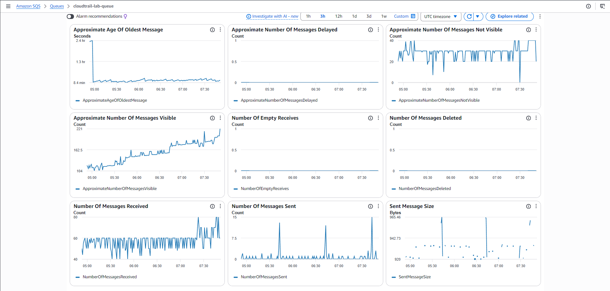

</details>

**Investigation:** Checked Splunk's internal logs (`index=_internal`) and found the actual cause:
```
Warning: This message does not have a valid SNS Signature 
Invalid signature version None. Unable to verify signature.
```
The input had **SNS signature validation enabled**, but this pipeline sends S3 → SQS **directly**, with no SNS topic in between — so every message was being pulled, validation-checked against a signature that could never exist, rejected, and left in the queue.

**Fix:** Disabled "SQS SNS Validation" in the input configuration. The 200+ message backlog drained immediately and events began flowing end-to-end.

**Why this matters:** This is a genuinely non-obvious AWS/Splunk integration gotcha — the kind of issue that costs real time in production environments — and diagnosing it required reading raw internal logs rather than assuming the pipeline configuration itself was broken.

<details>
<summary>📸 Screenshot: internal error logs during troubleshooting</summary>

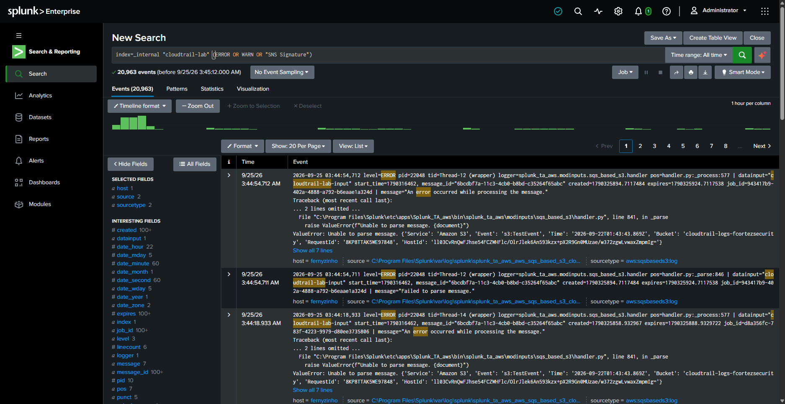

</details>

### 6. Historical data gap
**Problem:** Several detections initially returned zero results (root activity, IAM user creation, CloudTrail config changes) even though the underlying actions had genuinely occurred.
**Investigation:** Traced this to a simple sequencing issue: the S3 → SQS event notification was configured *after* several early setup actions (initial root browsing, first IAM user creation, initial trail creation) had already happened. Those log files existed in S3 but never triggered a queue message, since the notification didn't exist yet when they landed.
**Resolution:** Rather than trying to force a backfill, generated fresh, deliberate test events for each affected detection (a documented root login, a Stop/Start Logging toggle, etc.) and noted this limitation explicitly rather than hiding it — a real production pipeline would need backfill tooling or would simply start monitoring from its deployment date forward, which is exactly what happened here.

### 7. Dashboard layout in Splunk Dashboard Studio
**Problem:** New panels in Dashboard Studio's Grid layout kept stacking full-width instead of arranging side-by-side, and drag-to-resize wasn't cooperating.
**Fix:** Used Dashboard Studio's **Source code** view to directly edit the underlying JSON layout definitions (`x`, `y`, `w`, `h` position values), which is more reliable than the drag UI for precise multi-panel layouts.

---

## Data Pipeline Setup Summary

1. **IAM** — three scoped identities created (admin, activity-generator, legacy read-only)
2. **CloudTrail** — multi-region trail, management events (Read + Write), SSE-S3 encryption, log file validation enabled
3. **S3** — dedicated bucket for CloudTrail logs, event notification configured to publish to SQS on new object creation

<details>
<summary>📸 Screenshot: S3 event notification configuration</summary>

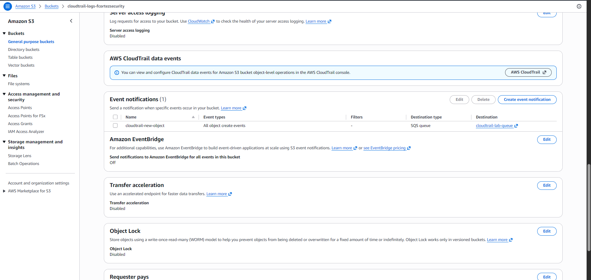

</details>

4. **SQS** — dedicated queue in the correct region, access policy scoped to allow only the specific S3 bucket to publish
5. **Splunk** — AWS Add-on installed, dedicated `splunk-aws-reader` IAM user (scoped to only `S3:GetObject/ListBucket` and `SQS:Receive/Delete/GetQueueAttributes/ListQueues/GetQueueUrl`), CloudTrail/SQS-based-S3 input configured into a dedicated `aws_cloudtrail` index

<details>
<summary>📸 Screenshot: SQS-Based S3 input configuration</summary>

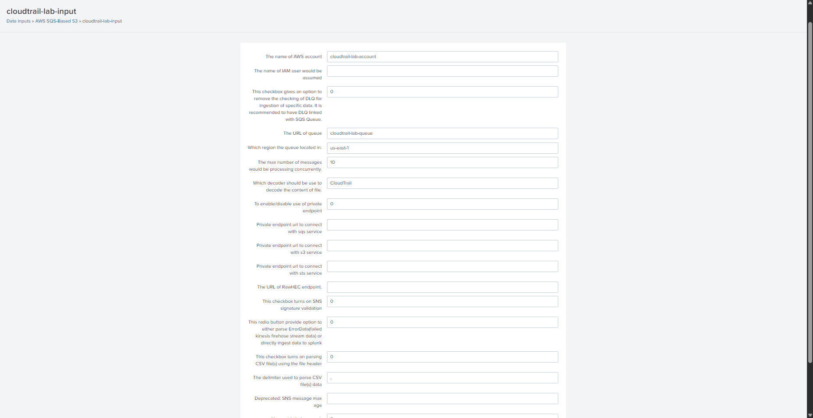

</details>

<details>
<summary>📸 Screenshot: first real parsed CloudTrail event in Splunk</summary>

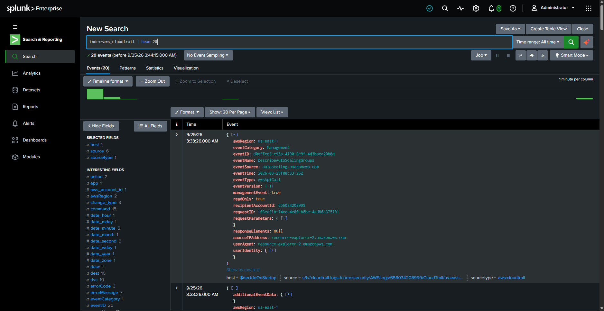

</details>

---

## Data Exploration

Before writing any detection logic, spent time understanding what the raw data actually looks like — field names, event structure, common noise vs. signal.

<details>
<summary>📸 Screenshot: event type breakdown (484 events, 168 distinct types)</summary>

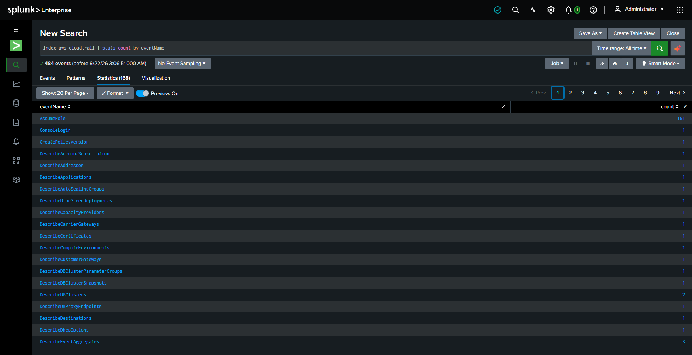

</details>

<details>
<summary>📸 Screenshot: raw ConsoleLogin event, fully expanded</summary>

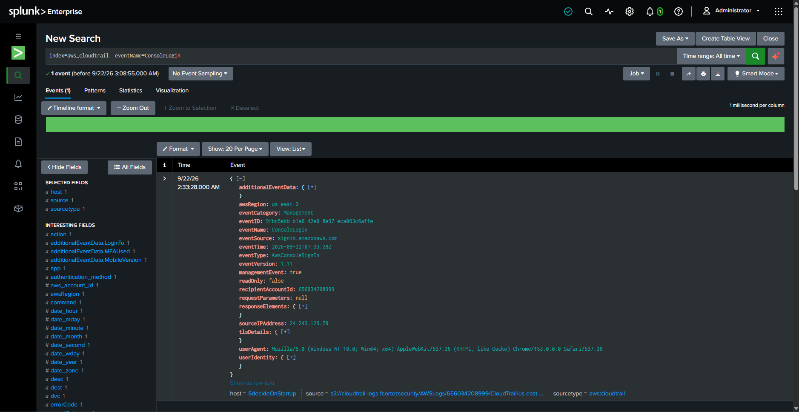

</details>

<details>
<summary>📸 Screenshot: activity breakdown by user and event type</summary>

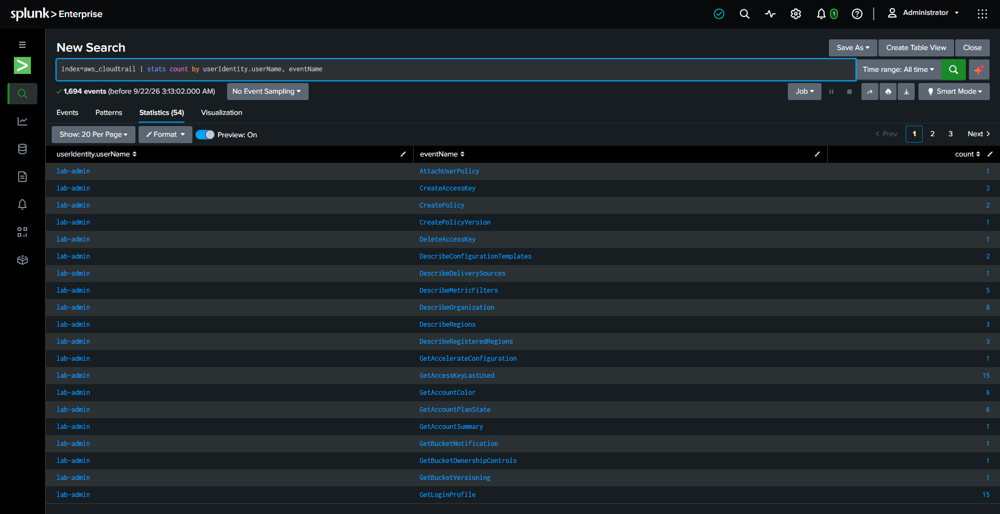

</details>

---

## Detection Engineering

Five detections, each built from raw event exploration → working SPL query → validated against real triggered activity → saved as a scheduled Splunk alert.

### Detection 1 — Root Account Activity
```spl
index=aws_cloudtrail userIdentity.type=Root
| table _time, eventName, eventSource, sourceIPAddress, awsRegion, errorCode
| sort -_time
```
**Why it matters:** The AWS root account has unrestricted access. Its use should be rare and deliberate.
**MITRE ATT&CK:** T1078.004 — Valid Accounts: Cloud Accounts
**Validated against:** A single, deliberate root login (billing check) — confirmed the detection fires correctly on real telemetry, and that root activity is otherwise absent from the account, consistent with least-privilege practice.
**Possible false positives:** Legitimate account-level tasks requiring root (billing, account closure); initial bootstrap before an admin IAM user exists.
**Investigation approach:** Check MFA usage on the session; look at whether the API-call burst pattern matches a console page load (expected) vs. scripted activity (concerning).

<details>
<summary>📸 Screenshot: Detection 1 firing on real test data</summary>

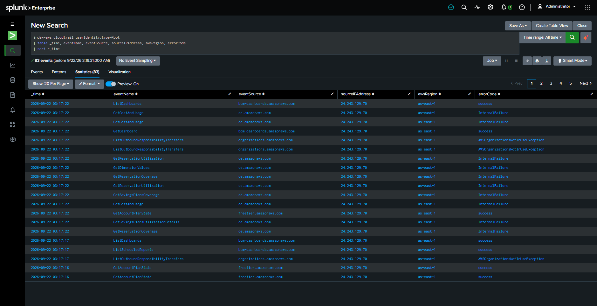

</details>

### Detection 2 — IAM Policy Modification
```spl
index=aws_cloudtrail eventName IN (AttachUserPolicy, AttachRolePolicy, PutUserPolicy, PutRolePolicy, DeleteUserPolicy, DeleteRolePolicy)
| table _time, userIdentity.userName, eventName, requestParameters.policyArn, requestParameters.userName, sourceIPAddress
| sort -_time
```
**Why it matters:** IAM policy changes directly control what identities can do — a common privilege-escalation and persistence vector.
**MITRE ATT&CK:** T1098.003 — Account Manipulation: Additional Cloud Roles
**Validated against:** Real event — `lab-admin` attaching `SplunkCloudTrailReadAccess` to `splunk-aws-reader` during pipeline setup.
**Possible false positives:** Legitimate admin activity; Infrastructure-as-Code (Terraform/CloudFormation) deployments managing IAM.
**Investigation approach:** Identify the actor; check whether the policy/target pairing makes sense; cross-reference against known deployments.

<details>
<summary>📸 Screenshot: Detection 2 firing on real test data</summary>

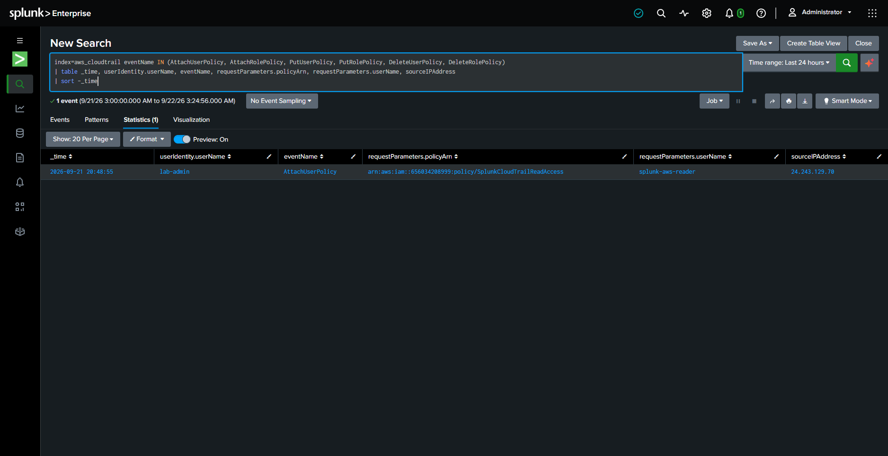

</details>

### Detection 3 — New IAM User / Access Key
```spl
index=aws_cloudtrail eventName IN (CreateUser, CreateAccessKey)
| table _time, userIdentity.userName, eventName, requestParameters.userName, sourceIPAddress
| sort -_time
```
**Correlation view** (the stronger investigation story):
```spl
index=aws_cloudtrail eventName IN (CreateUser, CreateAccessKey, AttachUserPolicy) userIdentity.userName=lab-admin
| table _time, eventName, requestParameters.userName, requestParameters.policyArn
| sort _time
```
**Why it matters:** New identities and credentials are common persistence mechanisms.
**MITRE ATT&CK:** T1136.003 (Create Account: Cloud Account) / T1098.001 (Account Manipulation: Additional Cloud Credentials)
**Validated against:** Real `AttachUserPolicy → CreateAccessKey → CreateAccessKey` chain for `splunk-aws-reader`, all within a 3-minute window — a genuine correlated sequence, not an isolated event.
**Possible false positives:** Legitimate service-account onboarding; admin-driven key rotation.
**Investigation approach:** Compare who performed the action against who it was for; check whether it's followed by policy attachment shortly after.

<details>
<summary>📸 Screenshot: Detection 3 correlation chain</summary>

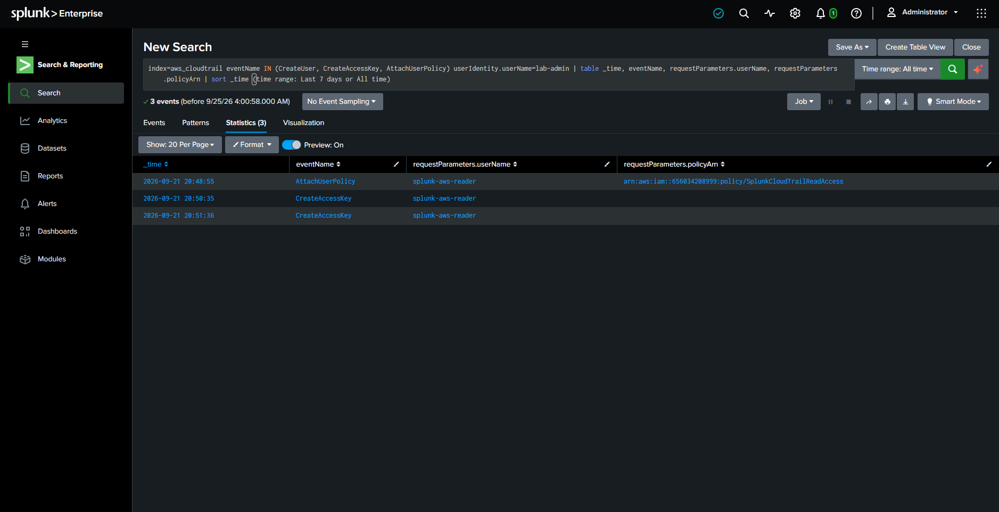

</details>

### Detection 4 — Authentication Failure Followed by Success
```spl
index=aws_cloudtrail eventName=ConsoleLogin
| transaction userIdentity.userName maxspan=10m
| search "responseElements.ConsoleLogin"="Failure" "responseElements.ConsoleLogin"="Success"
```
**Why it matters:** This pattern can indicate password-guessing, or simply a legitimate user mistyping their password.
**MITRE ATT&CK:** T1110.001 — Brute Force: Password Guessing
**Validated against:** A deliberate test — two failed logins followed by a success for `security-auditor`, 14 seconds apart, correctly grouped by Splunk's `transaction` command into one correlated unit.
**Possible false positives:** Legitimate mistyped passwords, autofill issues.
**Investigation approach:** Volume and timing matter (2 failures ≠ 20); check source IP against known-good baseline; confirm MFA was required and succeeded.

<details>
<summary>📸 Screenshots: raw sequence and correlated result</summary>

<table><tr>
<td>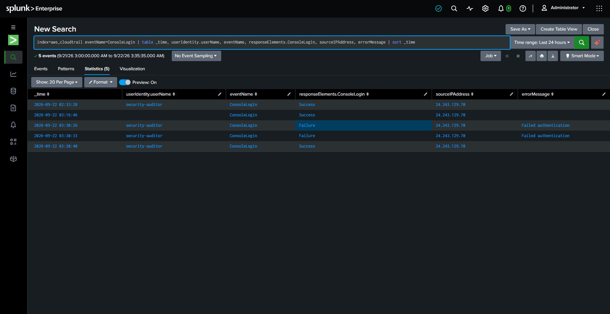</td>
<td>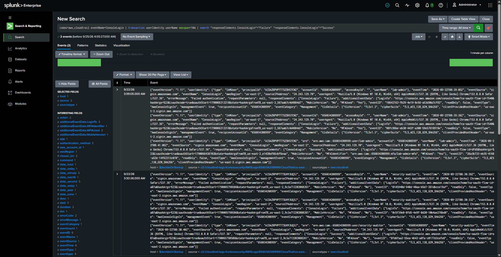</td>
</tr></table>

</details>

### Detection 5 — CloudTrail Configuration Changes
```spl
index=aws_cloudtrail eventName IN (StopLogging, DeleteTrail, UpdateTrail)
| table _time, userIdentity.userName, eventName, requestParameters.name, sourceIPAddress
| sort -_time
```
**Why it matters:** An adversary who wants to reduce visibility often targets logging infrastructure itself.
**MITRE ATT&CK:** T1562.008 — Impair Defenses: Disable or Modify Cloud Logs *(MITRE's own documentation for this technique specifically cites the CloudTrail `StopLogging` API call as an example)*
**Validated against:** A deliberate, brief Stop/Start Logging toggle by `lab-admin`, 4 seconds apart — confirming the detection fires and documenting the intentional test window.
**Possible false positives:** Planned maintenance/migration windows; cost-optimization changes to logged event types.
**Investigation approach:** Was logging re-enabled quickly (likely benign) or left off for an extended period (concerning)? Check actor identity and timing against known maintenance schedules.

<details>
<summary>📸 Screenshot: Detection 5 firing on real test data</summary>

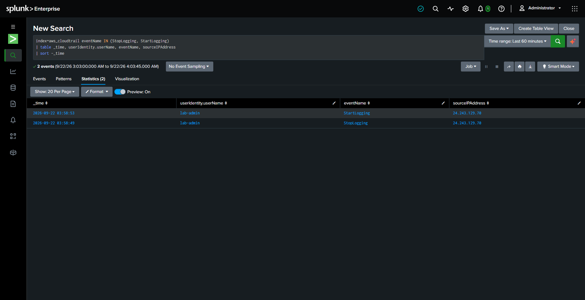

</details>

---

## Threat Hunting

Proactive hunts — not waiting for an alert, but asking specific security questions of the data.

| # | Hunting Question | Result | Conclusion |
|---|---|---|---|
| 1 | Has anyone modified IAM permissions recently? | 1 event — known, authorized setup action | Confirmed expected. No action needed. |
| 2 | Has the root account been used (7d)? | 106–214 events (varied by run), all clustered in short, documented sessions | Confirmed as documented test logins. No anomalies. |
| 3 | Who created an access key, and for whom? | 2 events, actor/target pairing consistent (`lab-admin` → `splunk-aws-reader`) | Confirmed authorized service-account provisioning. |
| 4 | Is activity coming from an unusual source IP? | 2 unfamiliar IPs found among 7 sources | **Investigated further** — traced to confirmed AWS-owned IP ranges (ASN AS16509) calling `ListPolicyStores` with no human user — benign AWS backend traffic. Baseline established: `24.243.129.70` is the only human source IP in this account. |
| 5 | Who is performing sensitive IAM operations? | 300+ events across dozens of actions, overwhelmingly `lab-admin` with scoped `security-auditor` activity | No unexpected cross-identity IAM activity; scoped identities behaving as designed. |

Hunt 4 is the standout — it's the one hunt that surfaced something genuinely unfamiliar, required actual investigation (IP ownership lookup, drill-down query), and reached a documented, evidence-backed conclusion rather than an assumption.

<details>
<summary>📸 Screenshot: Hunt 1 — IAM policy changes</summary>

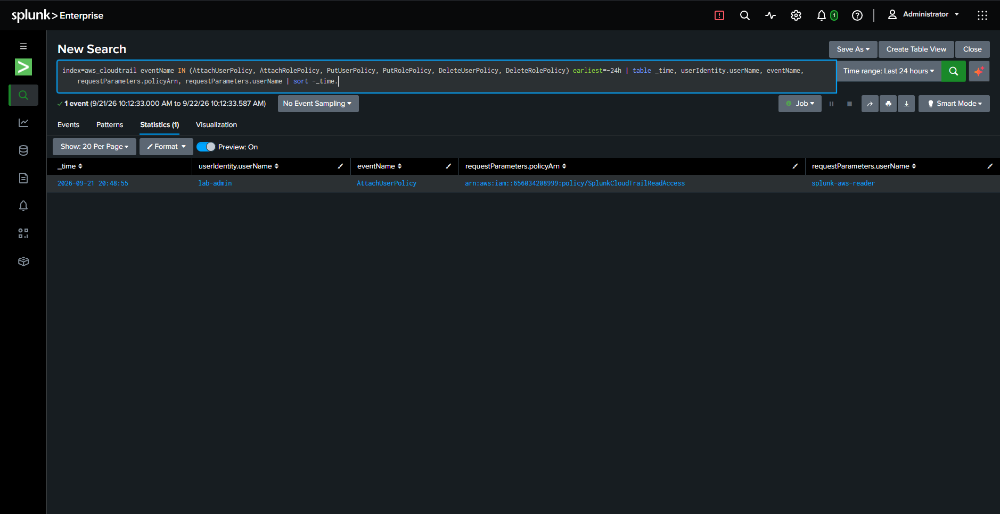

</details>

<details>
<summary>📸 Screenshot: Hunt 2 — root usage over 7 days</summary>

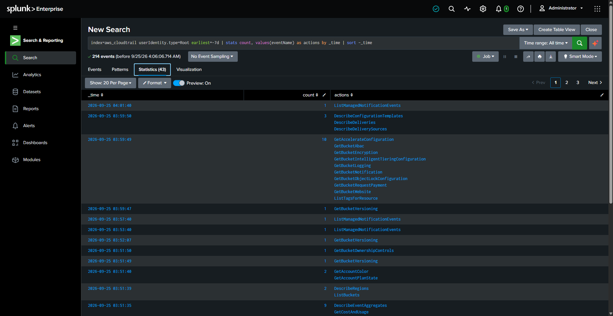

</details>

<details>
<summary>📸 Screenshot: Hunt 3 — access key creation</summary>

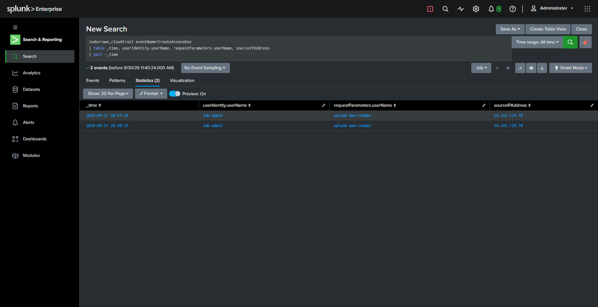

</details>

<details>
<summary>📸 Screenshots: Hunt 4 — source IP breakdown and drill-down</summary>

<table><tr>
<td>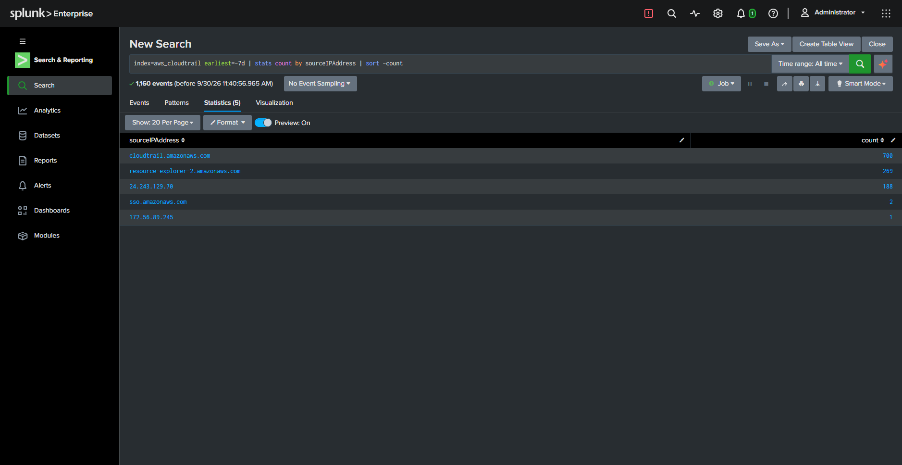</td>
<td>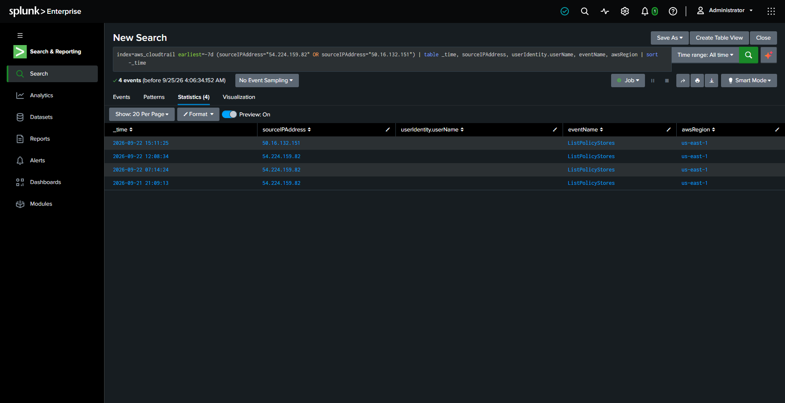</td>
</tr></table>

</details>

<details>
<summary>📸 Screenshot: Hunt 5 — IAM operations by user</summary>

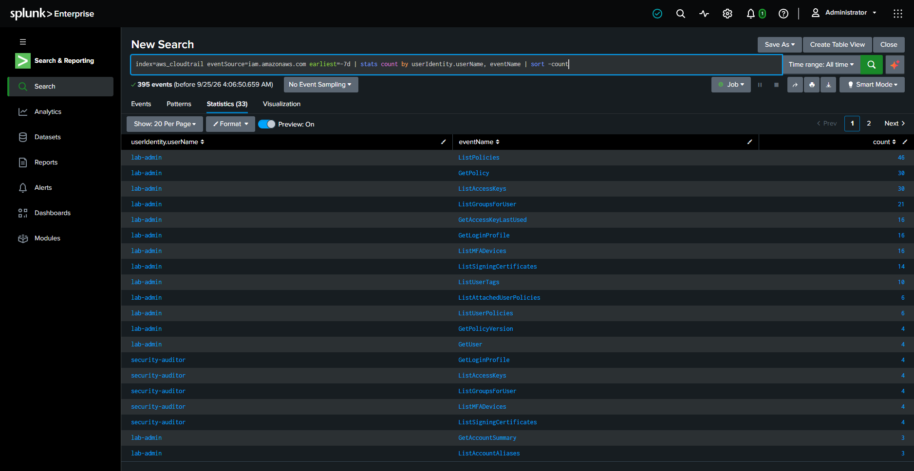

</details>

---

## Dashboard

A single-page Splunk Dashboard Studio dashboard (`AWS Cloud Security Monitor`) built from real query results:

- **KPI row:** Total Events (7d), IAM Changes (7d), Root Activity (7d)
- **Events Over Time:** hourly trend line — visually shows the two intensive build/testing sessions as clear spikes
- **Top Users** and **Top Source IPs:** side-by-side tables establishing behavioral baselines
- **Recent Security Events:** scrolling table of the latest 20 raw events

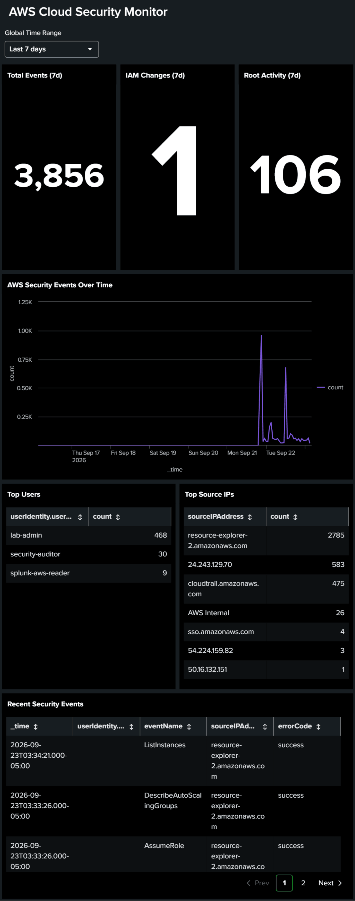

---

## Incident Report

**INCIDENT:** Multiple failed console login attempts followed by a successful authentication

**TIMELINE (UTC):**
| Time | Event |
|---|---|
| 08:30:26 | `ConsoleLogin` — Failure (`security-auditor`) |
| 08:30:33 | `ConsoleLogin` — Failure (`security-auditor`) |
| 08:30:40 | `ConsoleLogin` — Success (`security-auditor`) |

**ACTOR:** `security-auditor` (IAM user)
**SOURCE:** `24.243.129.70`
**AWS REGION:** us-east-2 (console sign-in endpoint routing; expected, not anomalous)
**HOW:** AWS Management Console, browser-based

**INVESTIGATION:** Correlated the three `ConsoleLogin` events via Splunk's `transaction` command. Confirmed same source IP and user agent across all three, 14-second total span. Checked for any follow-on IAM activity by `security-auditor` post-login — none found. Confirmed no unauthorized policy changes.

**FINDING:** Controlled lab test to validate Detection 4. Single-IP, single-user pattern with immediate success is consistent with a benign explanation (mistyped password), which the test was designed to simulate — not indicative of an actual credential-guessing attack (which would typically show higher volume, multiple source IPs, or distributed timing).

**RECOMMENDATION:** No remediation required for this test event. In production, this pattern should still be investigated every time it fires — confirm source IP/timing align with the account owner's known behavior; consider requiring MFA re-enrollment above a defined failure threshold.

**VALIDATION:** Confirmed Detection 4's alert fired correctly (verified via Splunk's Triggered Alerts). Confirmed no follow-on unauthorized activity. Re-ran the correlation query post-incident to confirm it correctly isolated this event chain.

---

## Remediation & Validation

Demonstrates the full **Detect → Investigate → Remediate → Validate** cycle with real evidence, using human-controlled remediation only (no automated resource modification, by design).

**Detect:** Reviewed `security-auditor`'s policy (`SecurityAuditorLabActions`) against its actual observed behavior across the full testing period.

**Investigate:**
```spl
index=aws_cloudtrail userIdentity.userName=security-auditor eventName IN (StopLogging, StartLogging, DescribeTrails) earliest=-7d
| stats count
```
Result: **0** — `security-auditor` had CloudTrail permissions it had never once used; all CloudTrail toggling was actually performed by `lab-admin`.

**Remediate:** Removed the unused `CloudTrailLabActions` statement from the policy, tightening `security-auditor` to only the permissions it actually exercises (IAM actions, EC2 security-group actions).

**Validate:**
- AWS Console: `security-auditor` attempting to access CloudTrail now returns `AccessDeniedException`.
- Splunk: the resulting `AccessDenied` events are captured and searchable in `aws_cloudtrail`, confirmed via:
```spl
index=aws_cloudtrail userIdentity.userName=security-auditor errorCode=AccessDenied eventName IN (DescribeTrails, StopLogging, StartLogging)
| table _time, eventName, errorCode, errorMessage
```

This closes the loop with real before/after evidence — not just a description of what *should* happen.

<details>
<summary>📸 Screenshots: remediation confirmed in AWS and in Splunk</summary>

<table><tr>
<td>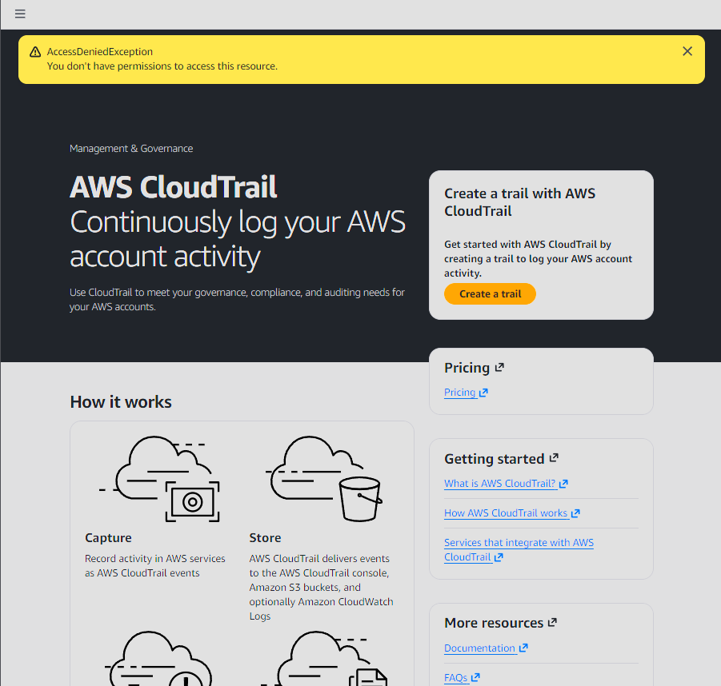</td>
<td>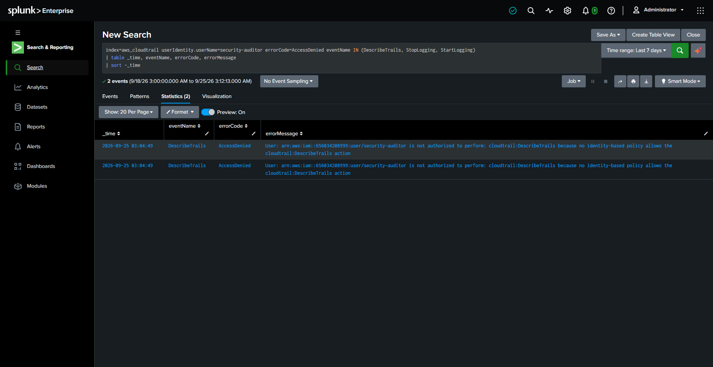</td>
</tr></table>

</details>

---

## Lessons Learned

- **Reading raw internal logs beats guessing.** The SNS signature validation bug would never have been found by re-checking the "obvious" configuration points — it required actually reading Splunk's own internal debug logs.
- **Sequencing matters in pipeline design.** Setting up monitoring *before* generating activity (not after) avoids the historical-gap issue encountered here — a real lesson for deploying monitoring in a live environment.
- **Least privilege is a process, not a one-time setup.** The remediation phase demonstrated that scoping permissions is something you revisit based on *actual observed usage*, not just what you assumed you'd need at design time.
- **Correlation tells a better story than single events.** Every detection here is stronger when it shows the chain of related actions (e.g., policy attach → key creation) rather than one isolated event.
- **Documenting a "nothing found" result is still valuable.** Several hunts concluded "confirmed benign, no action needed" — that's a legitimate, professional outcome, not a wasted query.

## Future Improvements

- Backfill tooling to capture historical S3 objects that predate SQS notification setup
- Additional detections around EC2/security-group modifications (permissions were provisioned but not yet built into a dedicated detection)
- CloudWatch Logs integration for real-time metrics alongside the S3/SQS batch pipeline
- Expand MITRE mapping coverage as new detections are added

---

## Interview Talking Points

If discussing this project in an interview, the strongest things to highlight:

1. **The SNS signature validation bug** — a real, non-obvious integration issue diagnosed by reading internal logs rather than re-checking surface-level config. Shows debugging methodology, not just following a tutorial.
2. **The historical data gap** — noticing detections returning zero results, correctly diagnosing *why* (sequencing, not a broken pipeline), and being transparent about the limitation in documentation rather than hiding it.
3. **The remediation demo** — a real least-privilege cleanup backed by evidence on both ends (AWS denial + Splunk telemetry of that denial), not just a description of the concept.
4. **Hunt 4 (unusual source IPs)** — the one hunt that required genuine investigation (IP ownership lookup) rather than confirming an already-known pattern — demonstrates the actual "hunting" mindset, not just running provided queries.
5. **Correlation logic** (`transaction` command, multi-event chains) — shows SPL competency beyond basic filtering.
